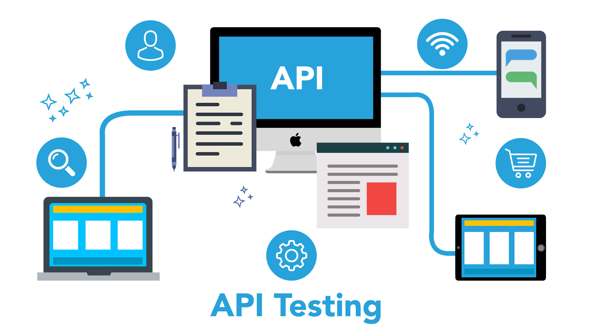

## rest api with express server

This is our frist api




## frist colne then repo and install

```console
$ npm install
```

## server istackcar

```js
const colors = require('colors');
const express = require('express');
const dotenv  = require('dotenv');


// env file config
dotenv.config();


// get env file value
const port = process.env.PORT || 5000 ; 


// express init
const app = express();


// data manage 
app.use(express.json());
app.use(express.urlencoded({extended : false}));


// express server create 
app.listen( port ,() => {

    console.log(`server is ranging on port ${port}`.bgGreen.black);
})
```

## packagees

* colors
* nodemon
* express
* multer
* nodemailer
* axios


